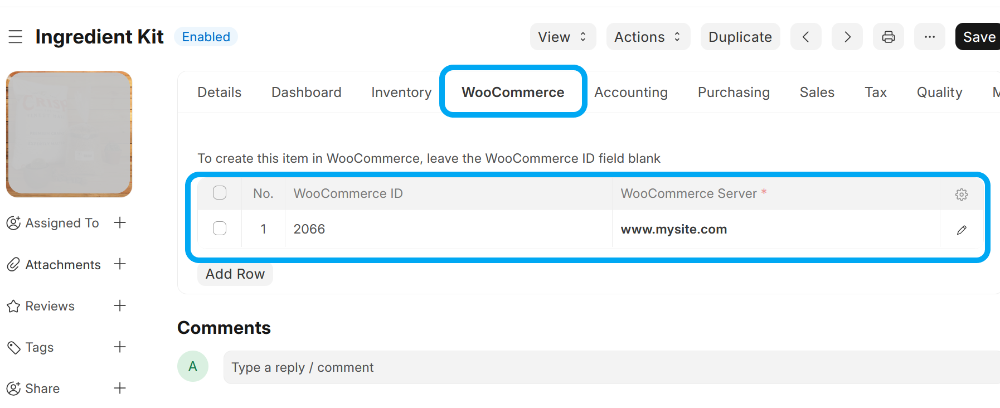
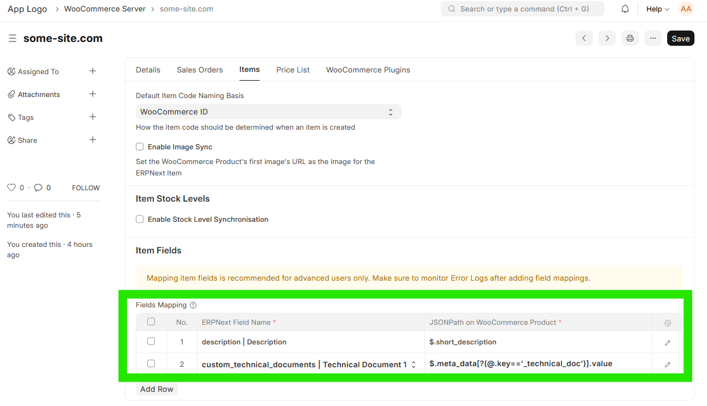

# Items Sync

## Setup

To link your ERPNext Item to a WooCommerce Product:
- If the WooCommerce Product already exists, specify the WooCommerce ID and WooCommerce Server
- If you want the item to be created in WooCommerce, specify only the WooCommerce Server

## Hooks

- Every time an Item is updated or created, a synchronisation will take place for the item if:
  -  A row exists in the **Item's** *WooCommerce Servers* child table with a blank/empty *WooCommerce ID* and *Enable Sync* is ticked: A linked WooCommerce Product will be created, **OR**
  -  A row exists in the **Item's** *WooCommerce Servers* child table with a value set in *WooCommerce ID* and *Enable Sync* is ticked: The existing WooCommerce Product will be updated

## Manual Trigger
- Item Synchronisation can also be triggered from an **Item**, by clicking on *Actions* > *Sync this Item with WooCommerce*
- Item Synchronisation can also be triggered from a **WooCommerce Item**, by clicking on *Actions* > *Sync this Product with ERPNext*

## Background Job

Every hour, a background task runs that performs the following steps:
1. Retrieve a list of **WooCommerce Products** that have been modified since the *Last Syncronisation Date* (on **WooCommerce Integration Settings**) 
2. Compare each **WooCommerce Product** with its ERPNext **Item** counterpart, creating an **Item** if it doesn't exist or updating the relevant **Item**

## Item Synchronisation Direction

The **Item Synchronisation Direction** setting on **WooCommerce Server** controls which system is authoritative for Item/Product master data:

| Mode | ERPNext → WooCommerce | WooCommerce → ERPNext |
| --- | --- | --- |
| Bidirectional | Yes | Yes |
| ERPNext to WooCommerce | Yes | No |
| WooCommerce to ERPNext | No | Yes |

The default is **Bidirectional**, which preserves the timestamp-based behaviour. Existing servers with an empty value are also treated as Bidirectional; no migration patch is required.

In **ERPNext to WooCommerce** mode, ERPNext Items can create or update Products. WooCommerce Products cannot update or create ERPNext Items. In **WooCommerce to ERPNext** mode, the inverse applies. Creation follows the same direction rules as updates.

The setting applies to Item master data, including names, SKU relationships, attributes, variants, images and custom Item field mappings. Stock and price synchronisation remain independent and keep their existing directions. Sales Orders continue to import from WooCommerce; in ERPNext-to-WooCommerce mode, every Product on an imported order must already be linked to an ERPNext Item.

Scheduled WooCommerce-to-ERPNext imports only query servers that permit inbound Item synchronisation. Changing the direction does not retroactively import WooCommerce changes made while inbound synchronisation was disabled.

**Match Items by SKU** continues to link an inbound Product to an existing ERPNext Item when inbound synchronisation is enabled and exactly one Item Code matches. It does not link or modify Items in ERPNext-to-WooCommerce mode.

## Synchronisation Logic
When comparing a **WooCommerce Item** with it's counterpart ERPNext **Item**, the `date_modified` field on **WooCommerce Item** is compared with the `modified` field of ERPNext **Item**. The last modified document will be used as master when syncronising

## Matching Items

A **WooCommerce Product** is paired with an ERPNext **Item** by the WooCommerce ID stored in the *WooCommerce Servers* table on the **Item**. A product that has never been synced has no such ID yet, so a new **Item** is created for it.

If your **Items** already exist in ERPNext with Item Codes that match your WooCommerce SKUs, check *Match Items by SKU* on **WooCommerce Server** to link them instead of creating duplicates:

- It is only used when a product has no WooCommerce ID stored against an **Item** yet. Products that are already linked are matched on their ID as before, so the setting can safely be turned on (or off) at any time, including on a site that is already syncing
- The product must carry an SKU, and exactly one **Item** must have that Item Code. If more than one matches, nothing is linked and an **Error Log** is created
- Once matched, the WooCommerce ID is written to the **Item**, and every later sync uses that ID

When *Default Item Code Naming Basis* is set to *Product SKU*, a **WooCommerce Product** created from an ERPNext **Item** also gets the Item Code as its `sku`, so that it can be matched back.

## Fields Mapping

| WooCommerce  | ERPNext      | Note                                                                                                                       |
| ------------ | ------------ | -------------------------------------------------------------------------------------------------------------------------- |
| `id`         | *Item Code*  | Only if *Default Item Code Naming Basis* is set to *WooCommerce ID* on **WooCommerce Server**                              |
| `sku`        | *Item Code*  | Only if *Default Item Code Naming Basis* is set to *Product SKU* on **WooCommerce Server**. Also used to match existing **Items** if *Match Items by SKU* is checked |
| `name`       | *Item Name*  |                                                                                                                            |
| `type`       |              | `simple` ≡ Normal **Item**                                                                                                 |
|              |              | `variable` ≡ Template **Item** (*Has Variants* is checked).                                                                |
|              |              | `variant` ≡ **Item** Variant (*Variant Of* is set)                                                                         |
| `attributes` | *Attributes* | Missing **Item Attributes* will automatically be created in both systems                                                   |
| `images[0]`  | *Image*      | One way sync - the URL of the first image on WooCommerce will be saved in the Image field. Setting  needs to be turned on. |

## Custom Fields Mapping

You can use [JSONPath](https://pypi.org/project/jsonpath-ng/) to map **Item** fields to specific **WooCommerce Product** fields.

Here are a few examples:
- `$.short_description` retrieves the content of the 'Short Description' WooCommerce Product field.
- `$.meta_data[0].id` retrieves the content of the first item's `id` field in the WooCommerce Product Metadata.
- `$.meta_data[?(@.key=='main_product_max_quantity_to_all')].value` retrieves the value of a Metadata entry with a `key` of `main_product_max_quantity_to_all`

where `$` refers to the **WooCommerce Product** object

To figure out the correct JSONPath expression, you can:
1. Go to any **WooCommerce Request Log** and filter for the `products` endpoints
2. Open [JSONPath Online Validator](https://jsonpath.com/) and copy the relevant object from the **WooCommerce Request Log** *Response* field to the *Document* text box.
3. Play around to get the JSONPath Query to return what you need. LLM's can be a big help here.

**Note that this is recommended for advanced users only.

On its own, a mapping row copies a value straight across - it does no reshaping. Where the two sides do not hold the same shape - a **child table**, a file path that has to become a URL, different keys or units - add a [Value Transform](/woocommerce_fusion_value-transforms), a Python function deployed by your own app.

## Troubleshooting
- You can look at the list of **WooCommerce Products** from within ERPNext by opening the **WooCommerce Product** doctype. This is a [Virtual DocType](https://frappeframework.com/docs/v15/user/en/basics/doctypes/virtual-doctype) that interacts directly with your WooCommerce site's API interface
- Any errors during this process can be found under **Error Log**.
- You can also check the **Scheduled Job Log** for the `sync_items.run_items_sync` Scheduled Job.
- A history of all API calls made to your Wordpress Site can be found under **WooCommerce Request Log** (*Enable WooCommerce Request Logs* needs to be turned on on **WooCommerce Server** > *Logs*)
